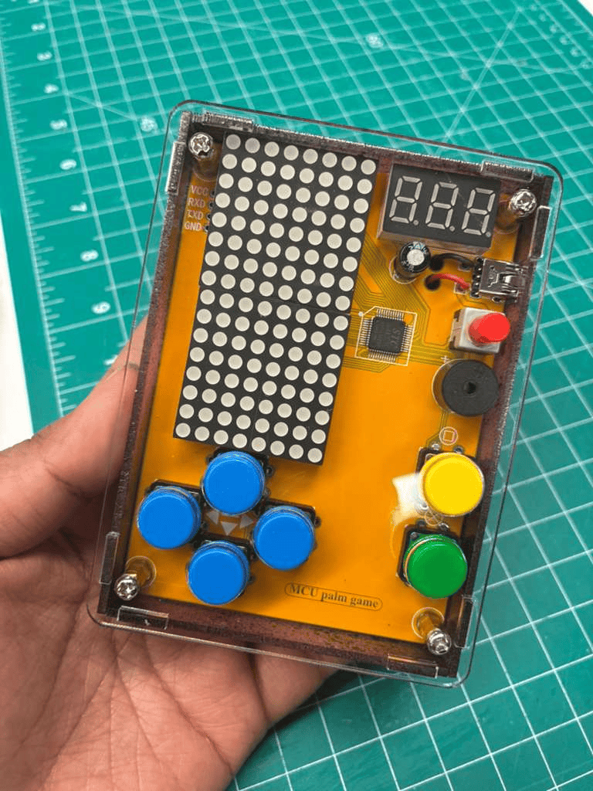
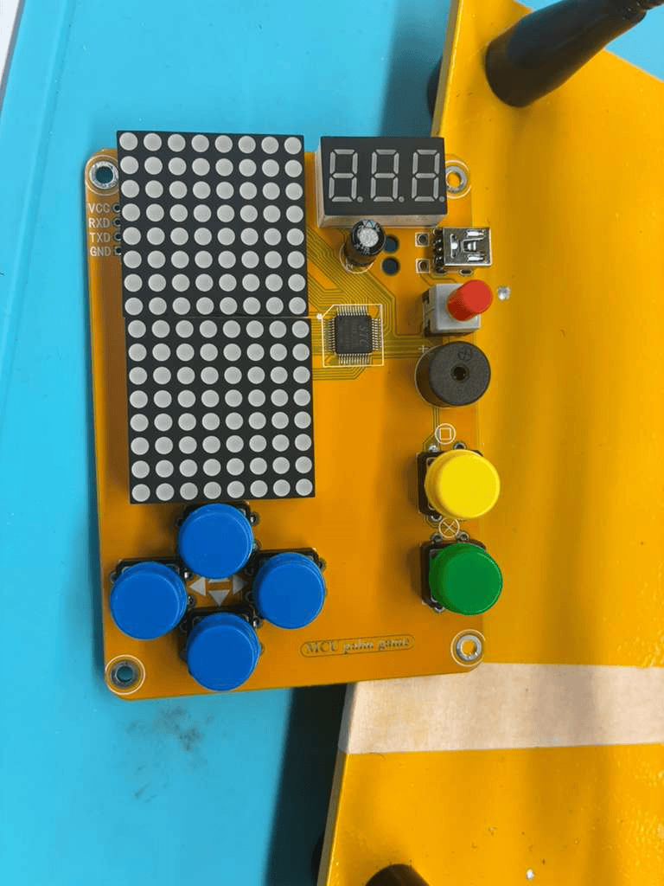

# Retro Gameboard
It is a retro handheld game console kit that I assembled from a PCB. It runs 5 classic games that are scored. I also spray painted the bottom and side pieces into a galaxy themed case. 

I soldered all the electronic components onto the PCB and installed buttons, connectors and power components. I later tested the power supply with a voltmeter. 

Aside from all the electronic components, I used soldering iron, wire, wire cutters, screws etc. 

